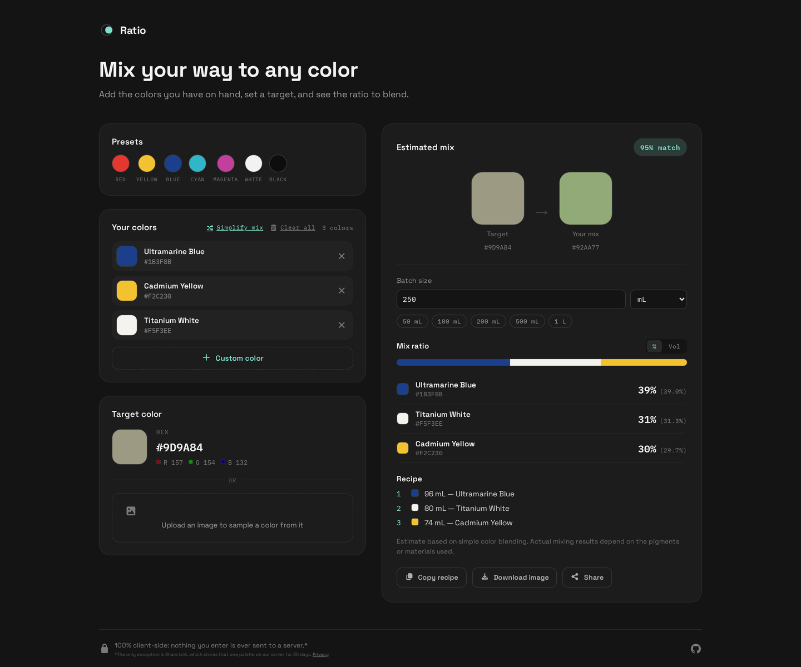

# Ratio: paint color mixer

[](https://github.com/Official-Husko/ratio-color-mixer/actions/workflows/docker.yml)
[](https://github.com/Official-Husko/ratio-color-mixer/releases/latest)
[](https://preactjs.com/)

A client-side calculator for artists and hobbyists: add the paints you have on hand, set a target color (by hex or by sampling a photo), and get back an estimated mixing ratio, expressed as percentages or as a volume (ml, L, or US fl oz/pint/quart/gallon) for a batch size you choose.

The app itself runs entirely in the browser and persists your work locally (`localStorage`). The one exception is the optional Share Link action: it stores that single palette on a small backend for 30 days (sliding: it resets on every visit) behind a short code, so anyone with the link can open their own independent, editable copy without your original changing. See `public/privacy.html` (linked from the footer) for the plain-language rundown of what that stores.



## Features

- Add colors from presets, a native color picker, or by sampling a pixel from an uploaded image
- Solves for the mix ratio that best reproduces a target color, using a painter-oriented (RYB-approximated) mixing model rather than a naive RGB average
- Batch size in your choice of volume unit, with a %/volume toggle
- Copy the recipe as text, download it as a PNG, or share a short link that opens a fresh, independently-editable copy for whoever opens it
- Everything persists locally (`localStorage`) between visits

## Tech stack

- [Preact](https://preactjs.com/) + TypeScript, built with [Vite](https://vite.dev/)
- [Vitest](https://vitest.dev/) for the test suite (frontend and the share API)
- [Oxlint](https://oxc.rs/) for linting
- `server/`: a small Node HTTP service backing Share Link, storing palettes in Redis with a 30-day sliding TTL. Everything else about the app has no backend, no database, and no external API calls.

## Getting started

```sh
npm install
npm run dev       # start the dev server
npm run build     # type-check and produce a production build in dist/
npm run preview   # serve the production build locally
npm run lint       # oxlint
npm run test       # vitest: color-math numeric parity + share-link tests
```

The frontend alone is fully usable without the share API: every feature works except creating/opening a Share Link (`npm run dev` proxies `/api/*` to `http://localhost:3000`, so start the API too if you want to exercise that: see below).

### Running the share API locally

`server/` is a separate npm package. It needs a Redis instance:

```sh
docker run --rm -p 6379:6379 redis:7-alpine
cd server
npm install
npm run build && npm start   # listens on :3000
```

## Running with Docker

`docker compose up --build` builds and runs the full stack: the frontend (multi-stage `Dockerfile`, served by nginx), the share API (`server/Dockerfile`), and Redis, with nginx reverse-proxying `/api/` to the API service so the frontend never needs CORS.

```sh
docker compose up --build
```

The site is then available at [http://localhost:8080](http://localhost:8080). To build/run the frontend image directly instead of via Compose (note this alone won't have a working Share Link, since it needs the `api`/`redis` services too):

```sh
docker build -t ratio-color-mixer .
docker run --rm -p 8080:80 ratio-color-mixer
```

The `api` service reads `REDIS_URL`, `SHARE_TTL_SECONDS` (default 2592000 = 30 days), `RATE_LIMIT_MAX`, and `RATE_LIMIT_WINDOW_MS` from the environment (see `docker-compose.yml` for the defaults).

### Getting a pre-built release instead of building locally

A GitHub Actions workflow (`.github/workflows/docker.yml`) lints, tests, and builds both images on every push and pull request. It doesn't push to a registry; instead, every push to `main` and every version tag (`v1.2.3`) publishes a [GitHub Release](https://github.com/Official-Husko/ratio-color-mixer/releases) with a downloadable `ratio-release-<commit>.tar.gz` bundle attached. That bundle is self-contained: it has both images already baked in via `docker save`, plus a matching `docker-compose.yml` and a `.env` pointing at the right image tag, so running it needs no registry at all:

```sh
tar -xzf ratio-release-<commit>.tar.gz
cd ratio-release-<commit>
docker load -i ratio-images.tar
docker compose up -d
```

(`docker compose` still pulls the stock `redis:7-alpine` image from Docker Hub on first run — only the two images this repo builds are bundled offline.)

Releases from a plain push to `main` are tagged `sha-<7-char-commit>` and marked as pre-releases (auto-generated per commit, pruned to the most recent 10 so the releases page doesn't fill up); pushing a `v1.2.3` tag produces a proper, permanent versioned release instead.

## SEO

`index.html` (canonical/OG/Twitter meta tags + JSON-LD) and `public/robots.txt`/`public/sitemap.xml` hardcode the production domain `https://ratio.lonewolves.dev`. If you deploy this somewhere else, update the domain in those three files (and regenerate `public/og-image.png`, the 1200×630 social preview card, if you want it to reflect a different look).

## Project structure

```text
src/
  lib/           # pure TS: color math solver, ratio/recipe formatting, share-link
                  # encode/decode + API calls, localStorage persistence, clipboard, image export/sampling
  hooks/         # useMixerState, the app's single stateful hook
  components/    # Preact UI components
  css/           # Font Awesome (icon font used throughout the UI)
server/
  src/           # the Share Link backend: a plain node:http server, Redis-backed
                  # storage with a sliding TTL, payload validation, per-IP rate limiting
```
